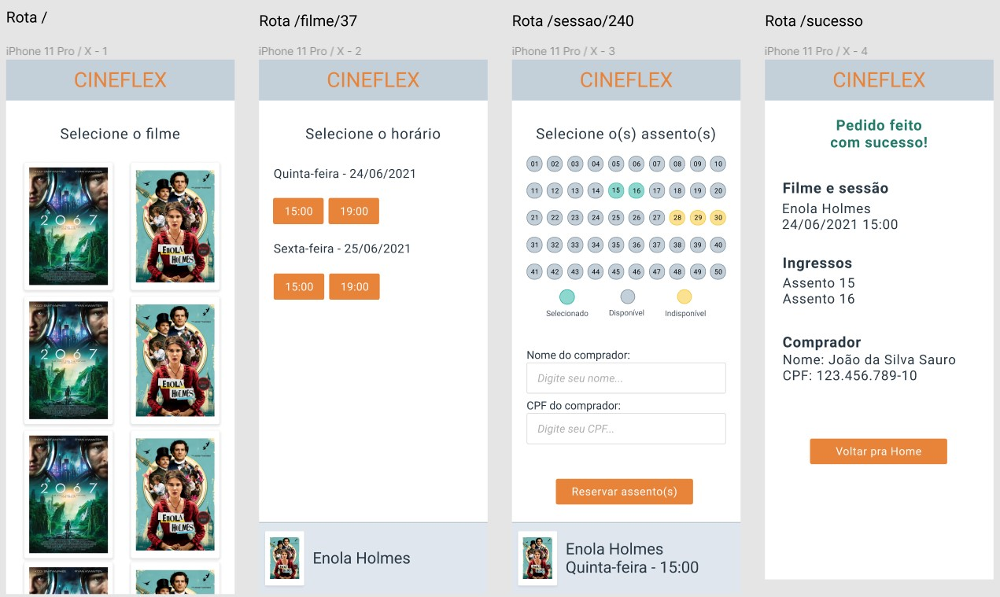

# Layout Projeto 9 - CineFlex

# Requisitos do projeto

### Escolha de Filme (rota "/")
- [x]  Buscar as informações dos filmes pela API fornecida e exibir conforme layout fornecido
- [x]  Ao clicar em um filme, o usuário deve ser redirecionado para a rota "/sessoes/:idFilme", sendo :idFilme o id do filme clicado

### Escolha de Sessão (rota "/sessoes/:idFilme")
- [x]  A partir do id da URL, obtenha da API as sessões disponíveis para o filme e exiba conforme o layout fornecido
- [x]  Ao clicar em uma sessão, o usuário deve ser redirecionado para a rota "/assentos/:idSessao", onde :idSessao é o id da sessão escolhida

### Escolha de Assento (rota "/assentos/:idSessao")
- [x]  A partir do id da sessão, buscar os dados da sessão da API e exibir o layout conforme fornecido
- [x]  Ao clicar em um assento disponível, o assento deve ser marcado como "Selecionado"
- [x]  Ao clicar novamente em um assento selecionado, este deve voltar para "Disponível"
- [x]  Ao clicar em um assento indisponível, deverá ser exibido um alerta de "Esse assento não está disponível"
- [x]  O usuário pode selecionar vários assentos
- [x]  O usuário deve poder inserir o nome e o CPF do comprador
- [x]  Ao clicar em "Reservar assento(s)", o pedido deve ser enviado para o servidor e o usuário deve ser redirecionado para a rota "/sucesso".  Isso fará com os assentos marcados fiquem indisponíveis para outras marcações.

### Rodapé
- [x]  Ao longo das telas de Sessão e Assento, deve ser exibido um rodapé com as informações do filme selecionado. Estas informações virão das chamadas à API em cada tela

### Sucesso
- [x]  Implementar layout conforme fornecido, exibindo os dados do pedido feito
- [x]  Ao clicar em "Home" o usuário deve voltar para a rota inicial ("/"), com o pedido zerado